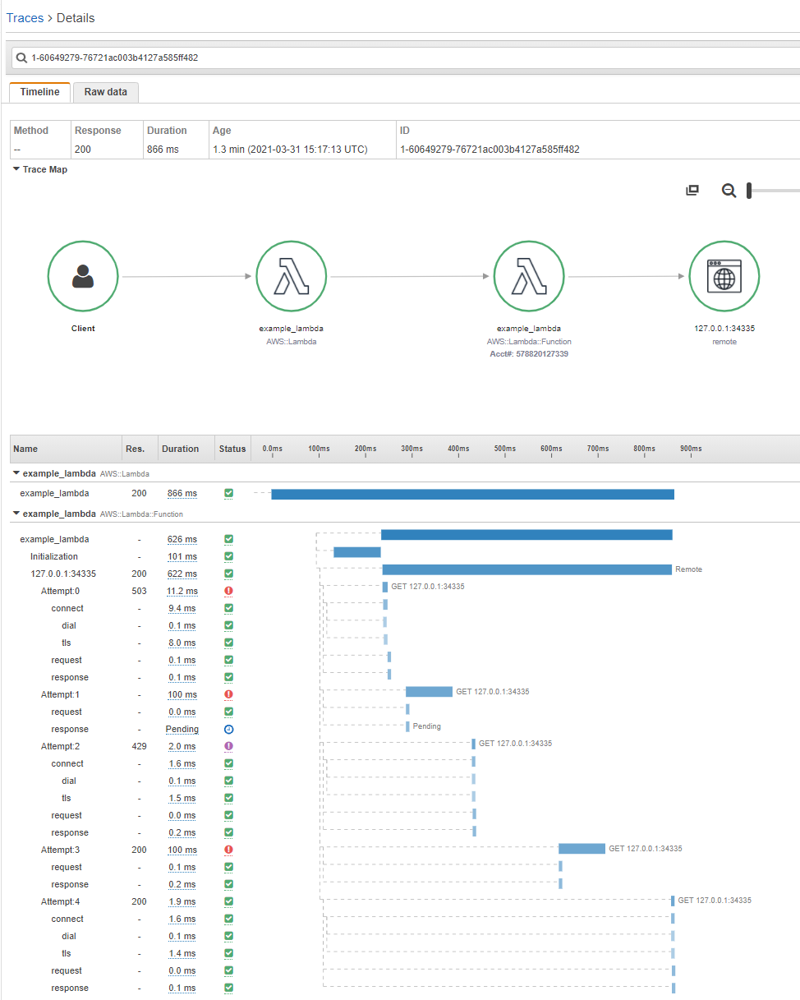

Example: Lambda
===============

*This example shows how to use the X-Ray plugin for httpx on Lambda.*

## Outcome

This example provides a Lambda Function demonstrating how the
[httpx](https://github.com/gogama/httpx) plugin (`httpxxray`) produces X-Ray
traces when run on Lambda.

When you invoke the Lambda Function, it starts a "local" HTTPS server running
within the Lambda sandbox and executes a simple GET request to the server using
an `httpx.Client` with the plugin installed. The first 4 attempts cause various
errors necessitating retry; the fifth attempt succeeds. The final X-Ray trace
thus shows one execution with 5 attempts as shown below.

  

## Steps

1. Build the example binary for a Lambda Function.
2. Create and configure your Lambda Function.
3. Invoke your Lambda Function.
4. View the generated trace in the AWS X-Ray console.

### 1. Build Lambda binary

Build the example binary using the Lambda:

```sh
$ GOOS=linux go install github.com/gogama/aws-xray-httpx/example/lambda
```

The above will download and build an executable named `lambda` which can be used
as an AWS Lambda Function. The executable will be built to `GOBIN`

Now change directories to `GOBIN` (if `go env GOBIN` is blank this is just the
current working directory) and create a ZIP file containing the built binary:

```sh
$ zip lambda.zip lambda
``` 

*If you struggle with this step, you may find the AWS Docs "Blank Go Lambda
Function" [example project](https://github.com/awsdocs/aws-lambda-developer-guide/tree/main/sample-apps/blank-go)
to be helpful.*

### 2. Create and configure your Lambda Function

*The below steps explain how to set up the Function using the AWS Lambda
console, but you may also use the AWS CLI.*

1. In the AWS console, create a new Lambda Function named `example_lambda`
   using the "Go 1.x" runtime.
2. After creating your new Function, configure it:
    - On the **Code** tab, edit the runtime settings to set the handler name
      to `lambda`.
    - On the **Code** tab, upload the `lambda.zip` file you created in the
      previous step.
    - On the **Configuration** tab, go to "Monitoring and operations tools" and
      set enable *Active tracing*. 

### 3. Invoke your Lambda Function

In the Lambda console, use the **Test** tab to invoke your new Function with a
test event.

Your example Function requires a `string` input (which it ignores) and Lambda
requires that you use valid JSON as the input, so use a bare JSON string as
the input, *e.g.* `"test"`. 

The logged output should look similar to this:

```
START RequestId: bad4bec3-b5f8-486a-b8f7-a8759eddd079 Version: $LATEST
2021-03-31T15:17:13Z [INFO] Emitter using address: 169.254.79.2:2000
END RequestId: bad4bec3-b5f8-486a-b8f7-a8759eddd079
REPORT RequestId: bad4bec3-b5f8-486a-b8f7-a8759eddd079	Duration: 626.70 ms	Billed Duration: 627 ms	Memory Size: 512 MB	Max Memory Used: 42 MB	Init Duration: 102.08 ms
XRAY TraceId: 1-60649279-76721ac003b4127a585ff482	SegmentId: 69b784723afaa375	Sampled: true
``` 

### 4. View trace in X-Ray console

In the AWS console, navigate to AWS X-Ray.

Select Traces and view the most recent trace. If your Lambda function's trace
does not appear, it is likely because you forgot to enable *Active tracing*.
