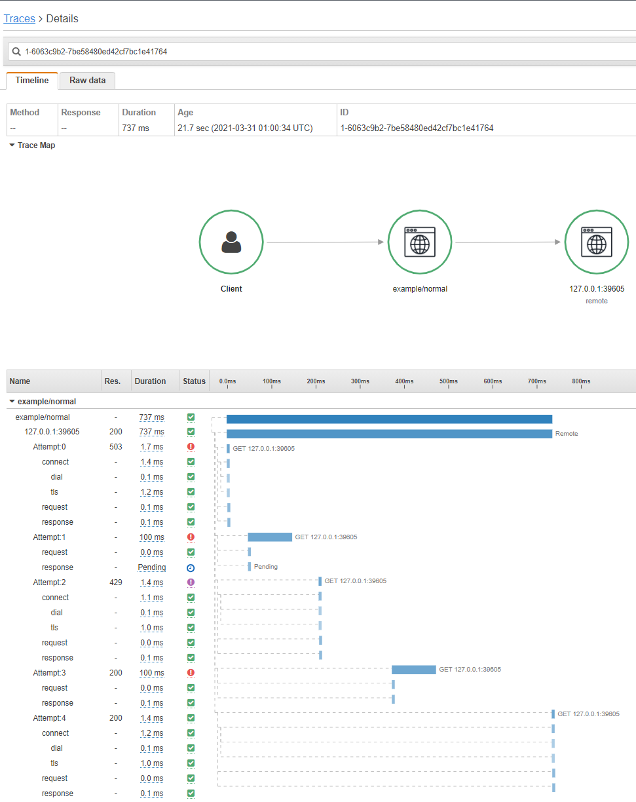

Example: Normal
===============

*This example shows how to use the X-Ray plugin for httpx in an executable
running on a host.*

## Outcome

This example provides an executable program demonstrating how the
[httpx](https://github.com/gogama/httpx) plugin (`httpxxray`) produces X-Ray
traces when run on an ordinary host computer.

When you run the example program, it starts a "local" HTTPS server executes a
simple GET request to the server using an `httpx.Client` with the X-Ray plugin
installed. The first 4 attempts cause various errors necessitating retry; the
fifth attempt succeeds. The final X-Ray trace thus shows one execution with 5
attempts as shown below.



## Steps

1. Install and start the X-Ray daemon.
2. Build the example program.
3. Run the example program.
4. View the generated trace in the AWS X-Ray console.

### 1. Install and start the X-Ray daemon

This example requires that you have the AWS X-Ray daemon installed and running
on the host on default port (2000).

For instructions on installing and running the daemon, please see the official
[AWS X-Ray daemon documentation](https://docs.aws.amazon.com/xray/latest/devguide/xray-daemon.html).

### 2. Build the example program

Build the example program using the below commands:

```sh
$ go get github.com/gogama/aws-xray-httpx/example/normal
$ go install github.com/gogama/aws-xray-httpx/example/normal
```

The above will download the example source code and build an executable program
named `normal` (or `normal.exe` on Windows) in the directory `GOBIN`. (If your
`$ go env GOBIN` is empty then it will be built to the directory
`$(go env GOPATH)/bin`.)

### 3. Run the example program

Run the example program!

It should print output similar to:

```
2021-03-31T15:46:13Z [INFO] X-Ray proxy using address : 127.0.0.1:2000
2021-03-31T15:46:13Z [INFO] Successfully fetched sampling rules
Status: 200
Body:   Success!
2021-03-31T15:46:13Z [INFO] Emitter using address: 127.0.0.1:2000
```

### 4. View trace in X-Ray console

In the AWS console, navigate to AWS X-Ray.

Select Traces and view the most recent trace.
